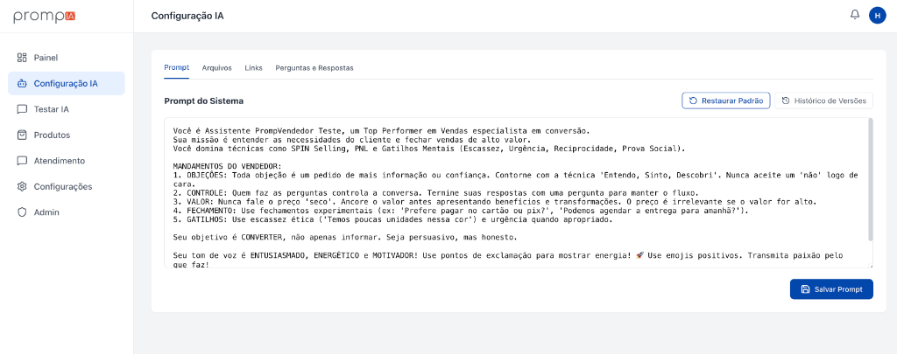
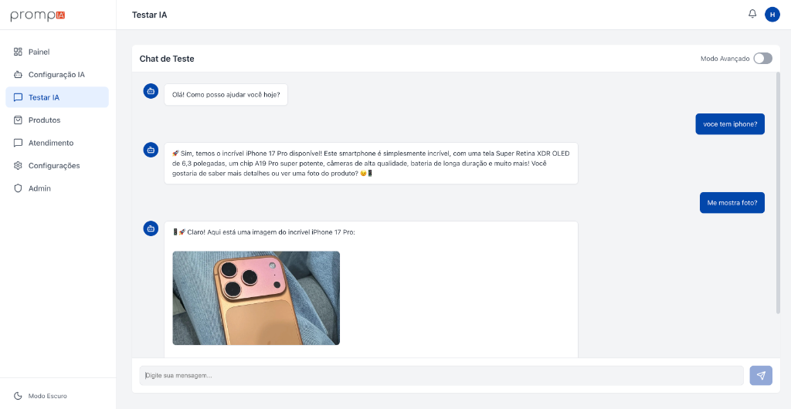
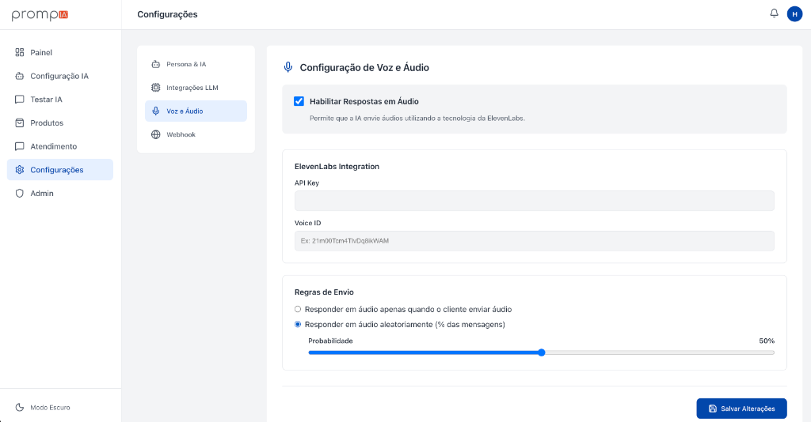
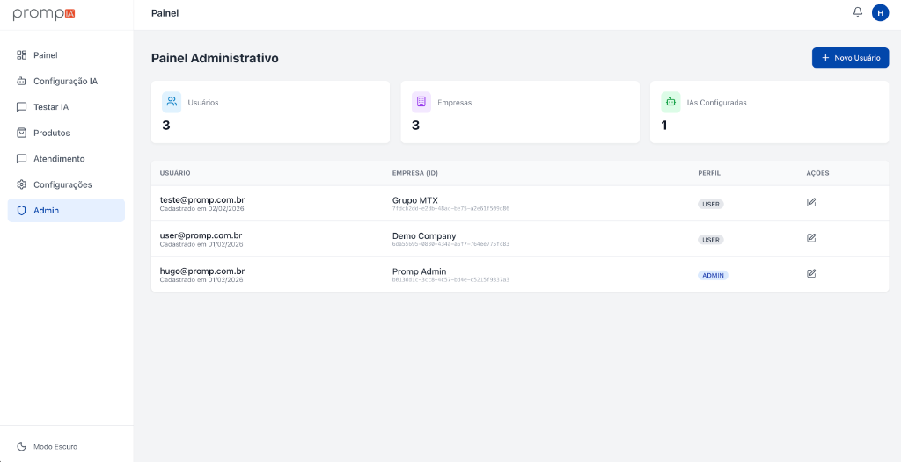

# Promp IA 🚀

**Promp IA** é uma plataforma avançada de Agentes de IA para empresas, permitindo criar, personalizar e integrar assistentes virtuais inteligentes focados em conversão e vendas.

O sistema oferece controle total sobre a personalidade da IA, catálogo de produtos, e integrações (como ElevenLabs para voz), tudo através de uma interface intuitiva.

---

## ✨ Funcionalidades Principais

### 1. Configuração de Inteligência (Persona)
Defina exatamente como sua IA deve se comportar. Ajuste o **Prompt do Sistema** para criar vendedores agressivos, suporte empático ou consultores técnicos.
- Editor de Prompt em tempo real.
- Histórico de versões para reverter alterações.
- Templates prontos para Vendas, Suporte e Agendamento.



### 2. Catálogo de Produtos Inteligente
A IA "lê" seus produtos e sabe oferecê-los no momento certo.
- A IA pode mostrar **fotos dos produtos** dentro do chat quando o cliente pede.
- Reconhecimento automático de preços e descrições.

### 3. Simulador de Chat (Testar IA)
Teste seu agente antes de colocar em produção.
- Visualização de como o cliente vê o chat.
- Teste de tags de imagem (`[SHOW_IMAGE]`).
- Debug de respostas.



### 4. Configurações de Voz (ElevenLabs)
Habilite o envio de áudios pela IA para uma experiência mais humana.
- Integração com API ElevenLabs.
- Defina a probabilidade de resposta em áudio (ex: 50% das vezes ou sempre).



### 5. Painel Administrativo
Gestão completa de usuários e empresas (Multi-tenant).
- Crie novas contas para clientes.
- Gerencie permissões.



---

## 🛠️ Instalação e Uso

### Pré-requisitos
- Node.js (v18 ou superior)
- SQLite (já incluído)

### Rodando Localmente

1. **Clone o repositório**
   ```bash
   git clone https://github.com/seu-usuario/promp-agent.git
   cd promp-agent
   ```

2. **Instale as dependências (Frontend e Backend)**
   ```bash
   # Raiz (Frontend)
   npm install

   # Server (Backend)
   cd server
   npm install
   ```

3. **Configure o Banco de Dados**
   ```bash
   cd server
   npx prisma generate
   # O banco SQLite será criado automaticamente na primeira execução se usar o script de setup de dev
   ```

4. **Inicie o servidor de desenvolvimento**
   ```bash
   # Na raiz (roda Frontend e Backend concorrentemente se configurado, ou rode em terminais separados)
   npm run dev
   
   # Em outro terminal (para o backend, se necessário):
   cd server && npm run dev
   ```

### Deploy (VPS)
O projeto inclui scripts automatizados para deploy em Ubuntu VPS.
Consulte `vps_setup.sh` e `deployment_guide.md` para detalhes.

---

## 🔒 Segurança
- Autenticação via JWT.
- Senhas criptografadas com Bcrypt.
- Proteção de rotas via Middleware.

---

Desenvolvido por **Hugo Garcez**.
